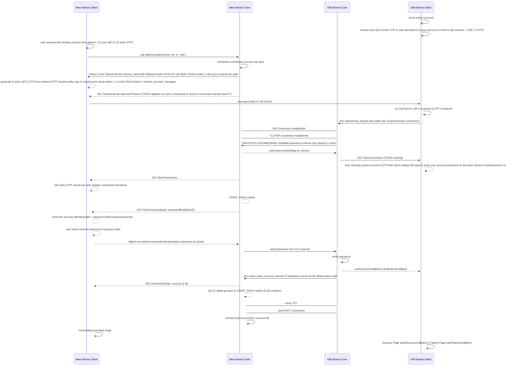
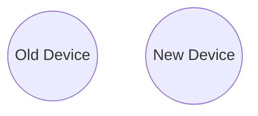
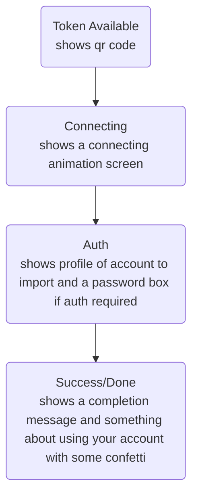
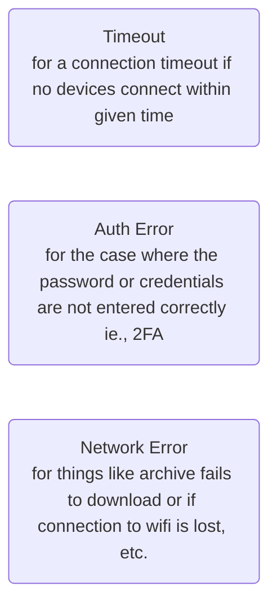

# New Link Device Documentation (WIP+TODO)



## Notes

- `AccountId` is an interaction that involves the user scanning a QR code displayed on the __New Device__ using the camera on the __Old Device__
- `Dht Connection` is an abstract representation of a lower-level set of operations performed by DhtNet
- `TLS Connection` is an abstract representation of a lower-level set of operations performed by TLS
- all other interactions are using the secure TLS protocol to transmit data
- `jami_account_archive` will be a default account config OR empty if __Old Device__ encounters an *error*

------

more notes on states:

- TokenAvail
  - client: need to show QR code on current screen (think it's add account screen TODO)
- ...

todos:

- ponder JAMS integration in future (2FA for authenticateAccount, etc.)

# Communication Channel Implementation

The two devices have to balance user interaction and TLS communication. The devices will use the DHT to initiate a peer-to-peer connection and communicate over a single TLS channel. Both devices send and receive messages throughout the process of transferring the archive from the old device to the new device, so the channel is bidirectional.



# Future Plans for the Protocol

- the protocol should be reversible because not all devices have cameras and it may be more convenient to do the reverse OOB operation of scanning qr code from old device with new device (new device scans qr code from old device)
  - need to verify that this does not pose any security threats due to modifications to the order of presented certificate chains (ask Adrien)
  - need to rework the UI in order to accomodate the accessibility of being scan a qr from either end
- generalize protocol to request loading any account address via proxy account TLS connection with an API that accepts username (username  or other identifier of the account that is associated with the requested archive), password (password associated with opening this account), sender_id (tmp account that will send the archive over TLS)
  - need to make sure that connection is initiated first before password is sent and have some sort of verification code that the user must verify before the channel communicates the password or the archive to prevent mitm/faking/phishing

# Archive Download Communication Scheme v1.0

Developed after partner programming with Adrien on 2023-11-20.

## Summary

This protocol is for validating the account transfer by requiring a password or key that only the account owner can provide. This lock and key mechanism ensures that the archive cannot be exported by attackers.

## Diagrams

Old Device (client):

````mermaid
graph LR
	established-->error & schemeSent
	schemeSent-->error & requestTransmitted
	requestTransmitted-->error & authError & archiveSent
````

New Device (server):

````mermaid
graph LR
	established-->error & schemeKnown
	schemeKnown-->error & requestTransmitted
	requestTransmitted-->error & authError & archiveReceived
````

---------

## State Descriptions

- Established
  - communication channel is opened
  - scheme version needs to be communicated before any further interaction can occur
    - ensures backwards compatibility
    - web-like behavior is well-understood and can be built upon easily
- SchemeSent / SchemeKnown
  - ...
- GenericError
  - can be reached from any state if invalid message received
  - currently error states are terminal and will close the communication channel

- AuthError
  - if password is incorrect send this
  - currently error statses are terminal and will close the communication channel

# State Machine for Status Transitions

Two Signals:

1. `AddDeviceStateChanged`
   1.
2. `DeviceAuthStateChanged`
   1.

# Documentation of Status Codes

- 0XX
  - general description: TODO
  - list of codes
    - TokenAvailabe: TokenAvail, 1
    -
- 1XX
  - some sort of continuation
- 2XX

# Android UI Demo

## New Device

### Flow



### Error States

These error states can occur at any time and modify the above flow of UI changes.


