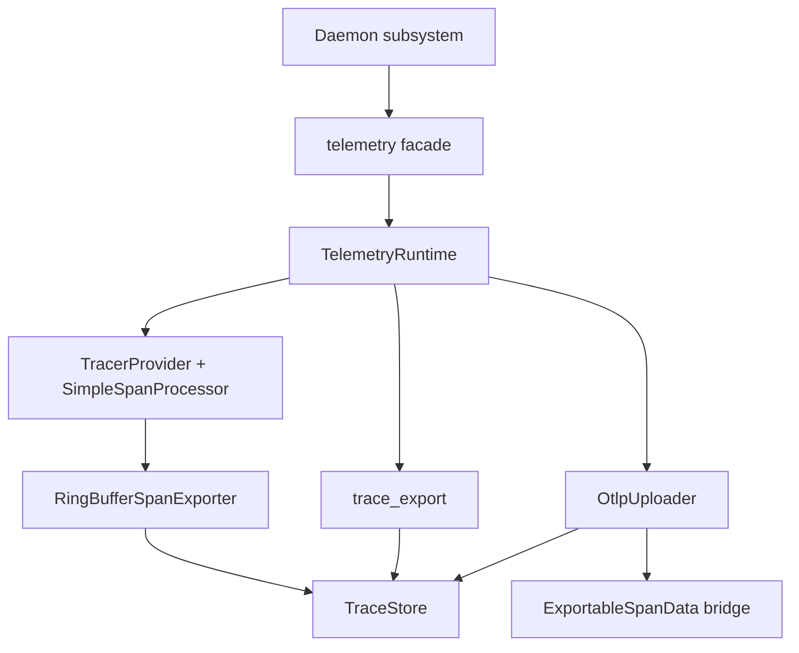

# OpenTelemetry Telemetry Architecture

## Purpose

This document describes the current OpenTelemetry-based telemetry subsystem used
by the daemon.

It is separate from `doc/trace/*`, which covers the daemon's static LTTng trace
points rather than the OpenTelemetry runtime described here.

## High-Level Model

The telemetry subsystem is centered around a bounded in-memory ring buffer.
Completed spans are first snapshotted into daemon-owned storage, and every other
export path reads from that same buffer.

The current behavior is:

- the daemon initializes telemetry once with service name, version, and local
  device ID;
- a global tracer provider is installed with a single processor that writes
  completed spans into the ring buffer;
- `exportTraces()` serializes the buffered snapshots to a local JSON file for
  clients;
- optional OTLP HTTP export replays buffered spans from the same store when the
  feature is compiled in and an endpoint is configured in the environment;
- shutdown stops the uploader, flushes the provider, resets the global provider,
  and clears the ring buffer.

The default trace store capacity is 5 MiB.

## Public API

Daemon code uses the facade in `src/telemetry/telemetry.h`. The public API does
not expose OpenTelemetry SDK types.

Current public entry points:

```cpp
void initTelemetry(const std::string& serviceName,
                   const std::string& version,
                   const std::string& deviceId);

void shutdownTelemetry();
bool isInitialized() noexcept;

SpanHandle startSpan(std::string_view name,
                     const SpanStartOptions& options = {});

SpanHandle startChildSpan(const SpanHandle& parent,
                          std::string_view name,
                          const SpanStartOptions& options = {});

void recordTrace(const std::string& name,
                 const std::map<std::string, std::string>& attributes = {});

std::string exportTraces(const std::string& destinationPath = {});
```

`SpanHandle` is move-only. It owns a live span, supports attribute and event
updates, and ends the span on destruction if the caller did not close it first.
Parent-child relationships are explicit through `startChildSpan()`.

`recordTrace()` remains the one-shot convenience helper for short spans that do
not need an explicit handle.

## Module Layout

The telemetry implementation is split by responsibility under `src/telemetry/`:

- `telemetry.h` and `telemetry.cpp`: public facade used by the rest of the
  daemon.
- `telemetry_runtime.h` and `telemetry_runtime.cpp`: lifecycle, tracer provider
  setup, span creation, local export coordination, and uploader coordination.
- `trace_types.h` and `trace_types.cpp`: daemon-owned span snapshot model and
  JSON conversion helpers.
- `trace_store.h` and `trace_store.cpp`: bounded ring buffer, sequence numbers,
  and eviction.
- `trace_export.h` and `trace_export.cpp`: local JSON export and default export
  path selection.
- `ring_buffer_span_exporter.h` and `ring_buffer_span_exporter.cpp`: SDK span
  exporter that snapshots completed spans into the ring buffer.
- `otel_recordable_bridge.h` and `otel_recordable_bridge.cpp`: rebuilds SDK
  recordables from stored snapshots for OTLP replay.
- `otlp_uploader.h` and `otlp_uploader.cpp`: OTLP HTTP endpoint resolution,
  retry loop, and background upload thread.

## Runtime Flow



The main span path is:

1. a subsystem starts a root span or child span through the public facade;
2. OpenTelemetry creates a live SDK span;
3. when the span ends, the configured exporter snapshots it into `TraceStore`;
4. the uploader is notified that new buffered spans are available;
5. local export and OTLP replay both read from `TraceStore` snapshots.

## Snapshot and Storage Model

`TraceStore` is the source of truth for buffered telemetry.

- each stored span is converted into a daemon-owned `SpanSnapshot`;
- snapshots carry resource attributes, instrumentation scope, events, and links;
- snapshots are assigned a monotonic sequence number when appended;
- eviction removes the oldest snapshots when the configured capacity is exceeded;
- oversized spans that cannot fit in the ring buffer are dropped.

The store lock only protects in-memory buffering and snapshot selection. JSON
serialization and network upload run after the relevant snapshot copy has been
taken.

## Local JSON Export

`exportTraces()` reads the current buffer and writes a JSON document with format
identifier `jami-traces/1`.

- if `destinationPath` is empty, the file is written under the daemon cache
  directory in `telemetry/traces-<timestamp>.json`;
- the file includes service name, service version, local device ID, generation
  time, and the serialized span list.

The public export path is wired through libjami and the DBus configuration
manager so clients can request a local trace dump.

## OTLP HTTP Replay

OTLP upload is optional and remains secondary to local buffering.

- it is compiled behind `JAMI_OTEL_EXPORT_ENABLED`;
- the uploader first checks `OTEL_EXPORTER_OTLP_TRACES_ENDPOINT`;
- if that is unset, it checks `OTEL_EXPORTER_OTLP_ENDPOINT` and appends
  `/v1/traces` when needed;
- upload batches are read from `TraceStore` using sequence numbers;
- failed uploads are retried by the background thread every minute;
- shutdown performs one last buffered upload attempt before the exporter is
  destroyed.

The OTLP uploader never becomes the source of truth; it only replays what is
already present in the ring buffer.

## Resource and Span Metadata

Telemetry runtime initialization attaches daemon metadata to the resource:

- `service.name`
- `service.version`
- `service.instance.id`
- `jami.device_id`

New spans also receive `jami.device_id` as a span attribute when the local
device ID is available.

## Daemon Integration Points

The daemon initializes telemetry during manager startup after loading or creating
the local device ID.

Current startup traces include:

- `daemon.startup`
- `daemon.device_id.ready` with the device ID state recorded as `loaded` or
  `created`

Telemetry shutdown is invoked from manager shutdown.

## Concurrency Model

The current API is designed for overlapping daemon operations.

- root spans are independent from one another;
- child spans are created explicitly from a parent handle;
- there is no implicit process-wide current span;
- the runtime lifecycle mutex, trace store mutex, and uploader control mutex are
  kept separate.

This allows multiple logical traces to be active at the same time without
sharing mutable global span state.