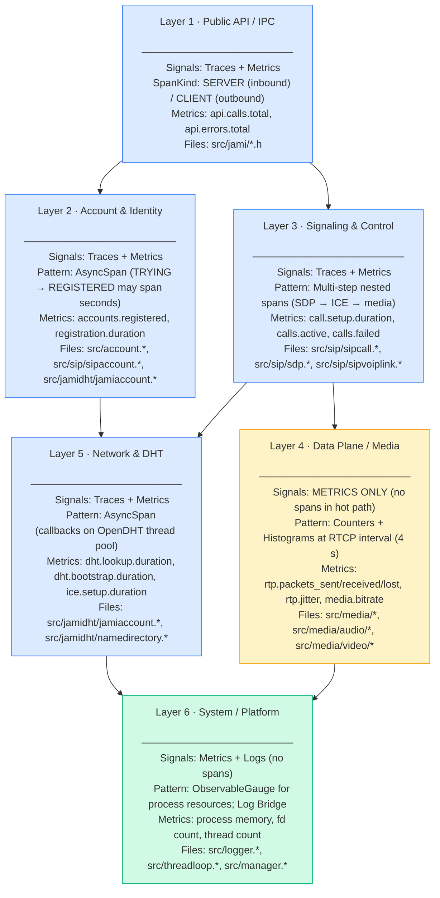

# jami-daemon Telemetry Architecture

**Status:** reviewed  
**Last Updated:** 2026-03-13  
**Applies to:** jami-daemon / libjami v16.0.0+

---

## Table of Contents

1. [Overview](#1-overview)
2. [Layer Model Diagram](#2-layer-model-diagram)
3. [Signal Type Rationale per Layer](#3-signal-type-rationale-per-layer)
4. [Implemented Instrumentation Inventory](#4-implemented-instrumentation-inventory)
5. [Span Hierarchy (Implemented)](#5-span-hierarchy-implemented)
6. [Cardinality Reference](#6-cardinality-reference)
7. [Roadmap — Future Instrumentation Phases](#7-roadmap--future-instrumentation-phases)
8. [Operational Notes](#8-operational-notes)

---

## 1. Overview

jami-daemon is instrumented using a **layered observability model** where the OTel
signal type (trace, metric, log) assigned to each layer matches the nature of the
operations in that layer:

- **Traces** capture the causal chain of async, multi-step operations that have a
  definite start, end, and success/failure outcome and where timing details at each
  step provide diagnostic value.
- **Metrics** capture continuous, high-frequency state that must be aggregated over
  time (counters, gauges, histograms) — particularly in the media data plane where
  per-packet instrumentation is cost-prohibitive.
- **Logs** are existing `JAMI_WARN`/`JAMI_ERR` calls forwarded to the OTel Logs
  Bridge API so they gain `trace_id`/`span_id` correlation without any changes to
  call sites.

The daemon is partitioned into **6 architectural layers**:

| Layer | Name | Nature |
|-------|------|--------|
| L1 | Public API / IPC | Entry point for all client-initiated operations |
| L2 | Account & Identity | Account lifecycle; cryptographic identity management |
| L3 | Signaling & Control | Call setup, SDP, ICE, SRTP negotiation |
| L4 | Data Plane / Media | Real-time audio/video encode–transmit–receive–decode |
| L5 | Network & DHT | DHT peer discovery, ICE connectivity, name resolution |
| L6 | System / Platform | Threading, logging, OS resources |

---

## 2. Layer Model Diagram



---

## 3. Signal Type Rationale per Layer

| Layer | Primary Signals | Why | What NOT to use |
|-------|----------------|-----|-----------------|
| **L1 — Public API** | Traces (root spans) + Metrics (request rate) | Every user-visible operation begins here; root spans provide end-to-end latency from client request to completion; request-rate counters power SLO dashboards | Logs (already covered by log bridge); per-request histograms with dynamic labels |
| **L2 — Account & Identity** | Traces (async multi-second spans) + Metrics (registration health) | Registration is async and takes 500 ms–30 s; a trace is the only way to reconstruct the multi-thread, multi-callback flow; error counters support alerting on auth failures | Logs (bridge handles this); fine-grained internal sub-spans inside archive loading (low value, high volume) |
| **L3 — Signaling & Control** | Traces (nested call setup spans) + Metrics (call SLO) | Call setup traverses SDP → ICE → media in sequence; each step can fail independently; step-by-step timing in a trace directly maps to user-perceived call setup time; histograms of `call.setup.duration` are the primary SLO instrument | Per-SIP-message spans (too fine-grained; SIP retransmits would flood); peer URI as any label |
| **L4 — Data Plane** | **Metrics ONLY** | The encode/decode loop runs at 50–100 Hz; one span per packet at 10 concurrent calls = 500–1000 span allocations/second = measurable encode jitter and buffer underruns; RTCP RR already delivers packet loss%, jitter, RTT every 4 s with zero overhead | **No spans in hot path** (absolute prohibition); per-packet histograms; dynamic call ID as a metric label |
| **L5 — Network & DHT** | Traces (async spans) + Metrics (network health) | DHT lookup and ICE negotiation are the dominant source of call setup latency variation; async callbacks come from OpenDHT's own thread pool — only traces with explicit context capture can reconstruct the causal chain; histograms track fleet-wide connectivity health | Peer IP addresses as any label or attribute (PII); raw account IDs or DHT InfoHash as metrics labels |
| **L6 — System / Platform** | Metrics + Log Bridge (no spans) | System resource meters (memory, FD count, thread count) are continuous gauges with no meaningful start/end; the log bridge provides trace-correlated structured logs from all existing `JAMI_WARN`/`JAMI_ERR` call sites with zero changes to those sites | Spans at this layer (no meaningful parent context); tracing inside `ThreadLoop::process()` |

---

## 4. Implemented Instrumentation Inventory

### 4.1 Bootstrap Module (`src/otel/`)

| File | Status | Description |
|------|--------|-------------|
| `src/otel/otel_init.h` | ✅ implemented | `OtelConfig`, `initOtel()`, `shutdownOtel()`, `getTracer()`, `getMeter()`, `getOtelLogger()` |
| `src/otel/otel_init.cpp` | ✅ implemented | Provider initialization for all three signals; exporter selection by `ExporterType` |
| `src/otel/otel_context.h` | ✅ implemented | `SpanScope` (RAII guard), `AsyncSpan` (async span handle with lambda capture) |
| `src/otel/otel_attributes.h` | ✅ implemented | All `jami.*` attribute key constants |
| `src/otel/otel_log_bridge.h` | ✅ implemented | `installOtelLogBridge()`, `removeOtelLogBridge()` API |
| `src/otel/otel_log_bridge.cpp` | ✅ implemented | Logger handler: severity mapping, trace context injection, `code.filepath`/`code.lineno` attributes |

### 4.2 Call-Level Metric Instruments (`src/call_metrics.h`)

| Instrument | Name | Type | Unit | Status |
|------------|------|------|------|--------|
| `active_calls` | `jami.calls.active` | `UpDownCounter<int64_t>` | `{calls}` | ✅ defined |
| `total_calls` | `jami.calls.total` | `Counter<uint64_t>` | `{calls}` | ✅ defined |
| `failed_calls` | `jami.calls.failed` | `Counter<uint64_t>` | `{calls}` | ✅ defined |
| `setup_duration` | `jami.call.setup.duration` | `Histogram<double>` | `ms` | ✅ defined |
| `call_duration` | `jami.call.duration` | `Histogram<double>` | `s` | ✅ defined |

### 4.3 Log Bridge

| What it captures | Severity filter (default) | Attributes injected |
|-----------------|--------------------------|---------------------|
| All `JAMI_WARN` calls | `≥ WARN` (min_severity=2) | `trace_id`, `span_id`, `code.filepath`, `code.lineno`, OTel Severity + SeverityText |
| All `JAMI_ERR` calls | `≥ WARN` (min_severity=2) | same |
| `JAMI_DBG` / `JAMI_INFO` | Only if `min_severity=0` | same |

Pass `min_severity=0` to `installOtelLogBridge()` to forward all log records
(useful for debug sessions; do not do this in production — media-thread DEBUG logs
are high-frequency).

### 4.4 Planned but Not Yet Implemented (Phase 5)

#### Spans

| Name | Layer | Files | SpanKind | When started | When ended |
|------|-------|-------|----------|--------------|------------|
| `call.outgoing` | L3 | `src/sip/sipcall.cpp` | CLIENT | `SIPCall::SIPCall()` (outgoing) | `Call::setState(OVER)` |
| `call.incoming` | L3 | `src/sip/sipcall.cpp` | SERVER | `SIPCall::SIPCall()` (incoming) | `Call::setState(OVER)` |
| `call.sdp.offer_build` | L3 | `src/sip/sdp.cpp` | INTERNAL | `Sdp::setLocalMediaCapabilities()` | After SDP offer sent |
| `call.sdp.negotiate` | L3 | `src/sip/sipvoiplink.cpp` | INTERNAL | `sdp_media_update_cb()` entry | `SIPCall::onMediaNegotiationComplete()` exit |
| `call.ice.init` | L3 | `src/sip/sipcall.cpp` | INTERNAL | `SIPCall::createIceMediaTransport()` | ICE init callback done |
| `call.ice.negotiate` | L3 | `src/sip/sipcall.cpp` | INTERNAL | `SIPCall::startIceMedia()` | `SIPCall::onIceNegoSucceed()` |
| `call.media.start` | L3 | `src/sip/sipcall.cpp` | INTERNAL | `SIPCall::startAllMedia()` | All `rtpSession->start()` complete |
| `account.register` | L2 | `src/account.cpp` | CLIENT | `Account::setRegistrationState(TRYING)` | Terminal state (`REGISTERED` or `ERROR_*`) |
| `account.dht.join` | L2 | `src/jamidht/jamiaccount.cpp` | INTERNAL | Before `dht_->run()` | `identityAnnouncedCb` fires |
| `account.sip.register` | L2 | `src/sip/sipaccount.cpp` | CLIENT | `SIPAccount::sendRegister()` | `onRegCallback()` |
| `dht.bootstrap` | L5 | `src/jamidht/jamiaccount.cpp` | INTERNAL | After `dht_->run()` | `identityAnnouncedCb(ok=true/false)` |
| `dht.peer.lookup` | L5 | `src/jamidht/jamiaccount.cpp` | CLIENT | `JamiAccount::startOutgoingCall()` | `forEachDevice()` end callback |
| `dht.channel.open` | L5 | `src/jamidht/jamiaccount.cpp` | CLIENT | `JamiAccount::requestSIPConnection()` | `JamiAccount::onConnectionReady()` |
| `name.directory.lookup` | L5 | `src/jamidht/jamiaccount.cpp` | CLIENT | Before `NameDirectory::lookupUri()` | In `LookupCallback` lambda |
| `media.session.start` | L4 | `src/media/rtp_session.{h,cpp}` | INTERNAL | `RtpSession::start()` | codec init complete (~`MediaEncoder::initStream()` success) |
| `media.codec.negotiate` | L4 | `src/media/media_encoder.cpp` | INTERNAL | `MediaEncoder::initStream()` entry | `initStream()` return |

#### Metrics (Phase 5)

| Instrument name | Type | Unit | Layer | File |
|-----------------|------|------|-------|------|
| `jami.account.registration.duration` | `Histogram<double>` | `ms` | L2 | `src/account.cpp` |
| `jami.account.registration.failures` | `Counter<uint64_t>` | `{failures}` | L2 | `src/account.cpp` |
| `jami.accounts.registered` | `UpDownCounter<int64_t>` | `{accounts}` | L2 | `src/account.cpp` |
| `jami.dht.bootstrap.duration` | `Histogram<double>` | `ms` | L5 | `src/jamidht/jamiaccount.cpp` |
| `jami.dht.lookups.total` | `Counter<uint64_t>` | `{lookups}` | L5 | `src/jamidht/jamiaccount.cpp` |
| `jami.dht.lookup.duration` | `Histogram<double>` | `ms` | L5 | `src/jamidht/jamiaccount.cpp` |
| `jami.dht.peers.connected` | `UpDownCounter<int64_t>` | `{peers}` | L5 | `src/jamidht/jamiaccount.cpp` |
| `jami.ice.setup.duration` | `Histogram<double>` | `ms` | L5 | `src/jamidht/jamiaccount.cpp` |
| `jami.name.directory.lookup.duration` | `Histogram<double>` | `ms` | L5 | `src/jamidht/namedirectory.cpp` |
| `jami.media.rtp.packets_sent` | `Counter<uint64_t>` | `{packets}` | L4 | `src/media/socket_pair.cpp` |
| `jami.media.rtp.packets_received` | `Counter<uint64_t>` | `{packets}` | L4 | `src/media/socket_pair.cpp` |
| `jami.media.rtp.packets_lost` | `Counter<uint64_t>` | `{packets}` | L4 | `src/media/audio/audio_rtp_session.cpp` |
| `jami.media.rtp.jitter` | `Histogram<double>` | `ms` | L4 | `src/media/audio/audio_rtp_session.cpp` |
| `jami.media.rtp.latency` | `Histogram<double>` | `ms` | L4 | `src/media/audio/audio_rtp_session.cpp` |
| `jami.media.audio.bitrate` | `ObservableGauge<double>` | `By/s` | L4 | `src/media/audio/audio_rtp_session.cpp` |
| `jami.media.video.bitrate` | `ObservableGauge<double>` | `By/s` | L4 | `src/media/video/video_rtp_session.cpp` |
| `jami.media.video.fps` | `ObservableGauge<double>` | `{frames}/s` | L4 | `src/media/video/video_rtp_session.cpp` |
| `jami.media.encode.duration` | `Histogram<double>` | `ms` | L4 | `src/media/video/video_sender.cpp` |
| `jami.media.session.count` | `UpDownCounter<int64_t>` | `{sessions}` | L4 | `src/media/rtp_session.{h,cpp}` |
| `jami.media.congestion.bandwidth_estimate` | `ObservableGauge<double>` | `By/s` | L4 | `src/media/congestion_control.cpp` |

---

## 5. Span Hierarchy (Implemented)

### Full Call Flow — Proposed Span Tree

The following represents the complete intended span tree for a JAMI P2P outgoing
call once Phase 5 instrumentation is complete. Items not yet implemented are
marked `[future]`.

```
call.outgoing  [SpanKind::CLIENT — SIPCall::SIPCall(), src/sip/sipcall.cpp]  [future]
│  Attributes: jami.call.direction="outgoing", jami.account.type="jami",
│              jami.call.id_hash=<16-hex>, jami.call.type="audio"|"video"
│
├── call.sdp.offer_build  [INTERNAL — Sdp::setLocalMediaCapabilities()]  [future]
│     Attributes: jami.sdp.direction="offer", jami.sdp.audio_codec_count=N
│
├── dht.peer.lookup  [SpanKind::CLIENT — JamiAccount::startOutgoingCall()]  [future]
│   │  Attributes: jami.dht.info_hash_prefix=<16-hex>
│   │
│   └── name.directory.lookup  [CLIENT — only if URI requires name lookup]  [future]
│         Attributes: name.server="ns.jami.net", name.response="found"|"not_found"
│
├── dht.channel.open  [CLIENT — JamiAccount::requestSIPConnection()]  [future]
│   │  Attributes: jami.ice.result="success"|"failure", channel_type="audioCall"
│   │
│   ├── ── SDP negotiation ──
│   ├── call.sdp.negotiate  [INTERNAL — sdp_media_update_cb()]  [future]
│   │     Attributes: jami.sdp.ice_path=true, jami.sdp.stream_count=2
│   │
│   ├── ── ICE ──
│   ├── call.ice.init  [INTERNAL — SIPCall::createIceMediaTransport()]  [future]
│   │   └── call.ice.candidate_gathering  [INTERNAL]  [future]
│   │         Attributes: jami.ice.candidate_count=N, jami.ice.has_srflx=true
│   │
│   └── call.ice.negotiate  [INTERNAL — SIPCall::startIceMedia()]  [future]
│         Attributes: jami.ice.stream_count=2
│
└── call.media.start  [INTERNAL — SIPCall::startAllMedia()]  [future]
    │  Attributes: jami.media.stream_count=2
    │
    ├── media.session.start  [INTERNAL — AudioRtpSession::start()]  [future]
    │     Attributes: jami.media.type="audio", jami.media.codec="opus",
    │                 jami.media.secure=true, jami.media.direction="sendrecv"
    │
    ├── media.codec.negotiate  [INTERNAL — MediaEncoder::initStream()]  [future]
    │     Attributes: jami.media.type="audio", jami.media.codec="opus",
    │                 jami.media.hwaccel=false
    │
    └── media.session.start  [INTERNAL — VideoRtpSession::start()]  [future]
          Attributes: jami.media.type="video", jami.media.codec="h264",
                      jami.media.hwaccel=true
```

### Account Registration Span Tree

```
account.register  [SpanKind::CLIENT — Account::setRegistrationState(TRYING)]  [future]
│  Attributes: jami.account.type="jami", jami.account.id_hash=<16-hex>
│
└── account.dht.join  [INTERNAL — JamiAccount::doRegister_()]  [future]
    │  Attributes: dht.bootstrap.count=3
    │
    └── dht.bootstrap  [INTERNAL — identityAnnouncedCb fires]  [future]
          Attributes: dht.proxy_enabled=false
```

For SIP accounts:

```
account.register  [SpanKind::CLIENT]  [future]
└── account.sip.register  [CLIENT — SIPAccount::sendRegister()]  [future]
    │  Attributes: server.address="registrar.example.com", server.port=5060
    │
    └── sip.transport.tls.handshake  [INTERNAL — only for TLS transport]  [future]
          Attributes: tls.protocol="TLSv1.3"
```

---

## 6. Cardinality Reference

The following table documents every metric instrument and its label cardinality
budget. The product of all label value counts gives the maximum number of
time-series per instrument.

| Metric Name | Labels | Max Cardinality | Why bounded |
|-------------|--------|----------------|-------------|
| `jami.calls.active` | `jami.account.type` × `call.direction` | 2 × 2 = **4** | `account.type` ∈ {sip, jami}; `direction` ∈ {incoming, outgoing} |
| `jami.calls.total` | `jami.account.type` × `call.direction` | **4** | same |
| `jami.calls.failed` | `jami.account.type` × `error.type` | 2 × 9 = **18** | `error.type` vocabulary is fixed (see otel_semconv.md §6) |
| `jami.call.setup.duration` | `jami.account.type` × `call.direction` × `ice.result` | 2 × 2 × 4 = **16** | `ice.result` ∈ {success, failure, timeout, turn_fallback} |
| `jami.call.duration` | `jami.account.type` × `call.direction` | **4** | — |
| `jami.account.registration.duration` | `jami.account.type` × `jami.account.manager` × `outcome` | 2 × 3 × 2 = **12** | `manager` ∈ {archive, server, none} |
| `jami.account.registration.failures` | `jami.account.type` × `error.type` | 2 × 6 = **12** | error.type vocabulary fixed |
| `jami.accounts.registered` | `jami.account.type` | **2** | — |
| `jami.dht.bootstrap.duration` | `outcome` × `proxy_enabled` | 2 × 2 = **4** | — |
| `jami.dht.lookups.total` | `result` | **4** | result ∈ {found, not_found, timeout, error} |
| `jami.dht.lookup.duration` | `result` | **4** | — |
| `jami.dht.peers.connected` | `channel_type` | **4** | channel_type ∈ {audioCall, videoCall, sync, msg} |
| `jami.ice.setup.duration` | `result` | **2** | result ∈ {success, failure} |
| `jami.media.rtp.packets_sent` | `jami.media.type` × `jami.media.codec` | 2 × 6 = **12** | codec set is bounded by `SystemCodecContainer` |
| `jami.media.rtp.jitter` | `jami.media.type` × `jami.media.codec` | **12** | — |
| `jami.media.encode.duration` | `jami.media.type` × `jami.media.hwaccel` | 2 × 2 = **4** | — |
| `jami.media.session.count` | `jami.media.type` | **2** | — |

**Rule:** if you add a new label to any of the above instruments, verify that the
worst-case cardinality remains < 100. If you add a new instrument, document its
labels and max cardinality in this table before merging.

---

## 7. Roadmap — Future Instrumentation Phases

### Phase 5 — Core Instrumentation (Next)

Target: inject all spans and metrics defined in §4.4.

**Call manager** (`src/sip/sipcall.cpp`, `src/sip/sipvoiplink.cpp`, `src/sip/sdp.cpp`):
- Full span tree: `call.outgoing` / `call.incoming` with child spans
- All call-level metrics via `src/call_metrics.h` `getCallMetrics()` binding
- Reference: [docs/kb/integration_call_manager.md](kb/integration_call_manager.md)

**Account management** (`src/account.cpp`, `src/sip/sipaccount.cpp`, `src/jamidht/jamiaccount.cpp`):
- `account.register` span at `Account::setRegistrationState(TRYING)`
- `account.dht.join`, `account.sip.register` child spans
- `jami.account.registration.*` metrics
- Reference: [docs/kb/integration_account_management.md](kb/integration_account_management.md)

**DHT layer** (`src/jamidht/jamiaccount.cpp`, `src/jamidht/namedirectory.cpp`):
- `dht.bootstrap`, `dht.peer.lookup`, `dht.channel.open`, `name.directory.lookup`
- All DHT and ICE metrics
- Context propagation via lambda capture (no `RuntimeContext` across OpenDHT threads)
- Reference: [docs/kb/integration_dht_layer.md](kb/integration_dht_layer.md)

**Media pipeline** (`src/media/audio/audio_rtp_session.cpp`, `src/media/video/video_rtp_session.cpp`):
- RTCP-interval metrics: jitter, packet loss, latency, bitrate
- `media.session.start`, `media.codec.negotiate` sparse spans
- Sampled encode duration (1-in-100 frames)
- Reference: [docs/kb/integration_media_pipeline.md](kb/integration_media_pipeline.md)

**ICE setup spans**:
- `call.ice.init`, `call.ice.candidate_gathering`, `call.ice.negotiate`
- Note: ICE negotiation lives partly in `dhtnet` (external library). If modifying
  `dhtnet` is not feasible, use coarser `ice.negotiation` span from
  `getIceOptions()` callback to `onConnectionReady()`.

**`hashForTelemetry()` utility**:
- Implement and test in `src/otel/otel_init.h` / `.cpp`
- Uniform SHA-256 + 16-hex-char truncation for all account, call, and peer IDs

---

### Phase 6 — Extended Coverage (Future)

**Media pipeline quality metrics** (expansion):
- `jami.media.congestion.bandwidth_estimate` ObservableGauge from `CongestionControl`
- `jami.media.congestion.bw_state` from `CongestionControl::get_bw_state()`
- RTCP-based estimated packet loss rate (as a Histogram with explicit buckets)

**Conference and swarm instrumentation**:
- `conference.participant.join` / `conference.participant.leave` spans
- `jami.conference.participants.active` UpDownCounter
- Swarm message delivery latency histogram: `jami.swarm.message.delivery.duration`

**W3C TraceContext over-the-wire**:
- Inject `traceparent` / `tracestate` W3C headers into the DHT invite JSON payload
  (`application/invite+json`)
- The receiving daemon extracts the trace context and parents its own
  `call.incoming` span on the caller's trace — enabling true cross-peer distributed
  traces
- Requires a schema change to the JAMI P2P call signalling protocol; plan with
  jami-daemon protocol team before implementation
- Reference: [docs/kb/integration_dht_layer.md](kb/integration_dht_layer.md) §Context Propagation

**System / platform metrics** (Layer 6):
- `jami.process.memory_rss_bytes` ObservableGauge from `/proc/self/status`
- `jami.process.fd_count` ObservableGauge from `/proc/self/fd`
- `jami.process.thread_count` ObservableGauge from `/proc/self/status`
- `jami.threadloop.restart_total` Counter incremented in `ThreadLoop::setup()`
  restarts

**Meson build system support**:
- Add `otel` option to `meson_options.txt`
- Add `find_package`-equivalent in `meson.build` using `dependency()`
- Ensure `ENABLE_OTEL` preprocessor definition is set consistently

**Android / iOS targets**:
- Add `opentelemetry-cpp` recipe to `contrib/src/`
- Configure with `WITH_OTLP_GRPC=OFF`, `WITH_OTLP_HTTP=ON` (no gRPC on mobile)
- Test against Android NDK logcat backend integration

---

## 8. Operational Notes

### Recommended OTLP Collector Setup

For production deployments, a **collector pipeline** between the daemon and the
backend provides buffering, sampling, and fan-out:

```
jami-daemon  →  OpenTelemetry Collector  →  Jaeger (traces)
             (OTLP/gRPC :4317)              Grafana Mimir (metrics)
                                            Loki (logs)
```

Use the [OpenTelemetry Collector Contrib](https://github.com/open-telemetry/opentelemetry-collector-contrib)
distribution, which includes the OTLP receiver, batch processor, and exporters for
Jaeger, Prometheus, Loki, and others.

Minimal collector configuration for local development:

```yaml
# otelcol-config.yml
receivers:
  otlp:
    protocols:
      grpc:
        endpoint: "0.0.0.0:4317"
      http:
        endpoint: "0.0.0.0:4318"

processors:
  batch:
    timeout: 5s
    send_batch_size: 512

exporters:
  debug:
    verbosity: normal
  # Add jaeger, otlphttp, prometheus exporters as needed

service:
  pipelines:
    traces:
      receivers: [otlp]
      processors: [batch]
      exporters: [debug]
    metrics:
      receivers: [otlp]
      processors: [batch]
      exporters: [debug]
    logs:
      receivers: [otlp]
      processors: [batch]
      exporters: [debug]
```

### Estimated Data Volume

The following estimates assume Phase 5 instrumentation is complete and the daemon
is handling a steady load of active calls. All estimates are unsampled (1:1 ratio).

| Signal | Rate per active call | 10-call deployment | 100-call deployment |
|--------|---------------------|-------------------|---------------------|
| Spans (call setup) | ~12 spans × 1/call | ~120 spans/call-setup | ~1,200 spans/call-setup |
| Spans (DHT) | ~5 spans × 1/call setup | 50 spans/setup | 500 spans/setup |
| Metrics export | ~35 instruments × 30 s interval | 35 time-series | 35 time-series (bounded) |
| Log records (WARN+ERR) | ~0–5/call (normal; more on failure) | < 50/minute | < 500/minute |

Span byte size (JSON): approximately 500–800 bytes per span (OTLP binary proto),
yielding < 1 MB/hour for 10 concurrent calls. This is negligible on any network.

Metrics are **static cardinality** — the number of time-series does not grow with
call count because call IDs are never used as metric labels.

### Sampling Recommendation

**Phase 5 (development/staging):** no sampling (`AlwaysOn` sampler, the default).
This captures all call traces for debugging; at low volumes (< 50 calls/hour) the
storage cost is trivial.

**Production fleet (> 50 calls/hour):** use `ParentBased(TraceIdRatioBased(0.1))`
(10% head sampling) or tail sampling at the collector based on span error status
(sample 100% of error traces, 5% of success traces). Configure in the daemon via
the `OtelConfig` before the SDK is widely deployed.

```cpp
// Example: enable ratio-based sampling at initOtel() time (not yet implemented):
config.sampling_ratio = 0.1;  // sample 10% of traces
```

Metrics and logs are **never sampled** — they are aggregated or filtered by
severity, not sampled.
